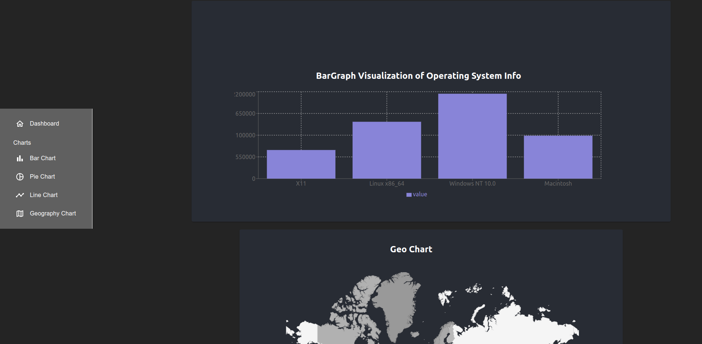

# Log Analyzer


## Description


This project is a robust log parser built with Python and React. The backend is powered by Python, utilizing the multithreading concept to efficiently parse large log files. This allows for concurrent processing, significantly reducing the time it takes to parse logs compared to a single-threaded approach.

The frontend is built with React, providing a user-friendly interface to interact with the log parser. we can view the parsed results directly in the browser. The React application communicates with the Python backend through a RESTful API, allowing for real-time updates and a seamless user experience.




### Prerequisites
- Python 3.8 or higher
- Node.js and npm
- Git

## Installation

1. Clone the repository:


```bash
git clone https://github.com/ishworrsubedii/python_react_log_analyzer.git

```
2. Navigate to the project directory

```
cd individual_dpc

```

### Python backend 
Create the conda env for better package management
```
conda create -n "logparser" python=3.10
```

Activate the environment

```
conda activate logparser
```
- Navigate to the project directory:

```
cd log_parser_python
```
- Install the Python dependencies:

```
pip install -r requirements.txt
```

### React frontend


```
npm install 
```
### Usage
1. Start the Python backend:

    - run main.py 

2. In a new terminal window, start the React frontend:

    - ``` npm run dev ```


## Contributing

Contributions are highly recommended and accepted